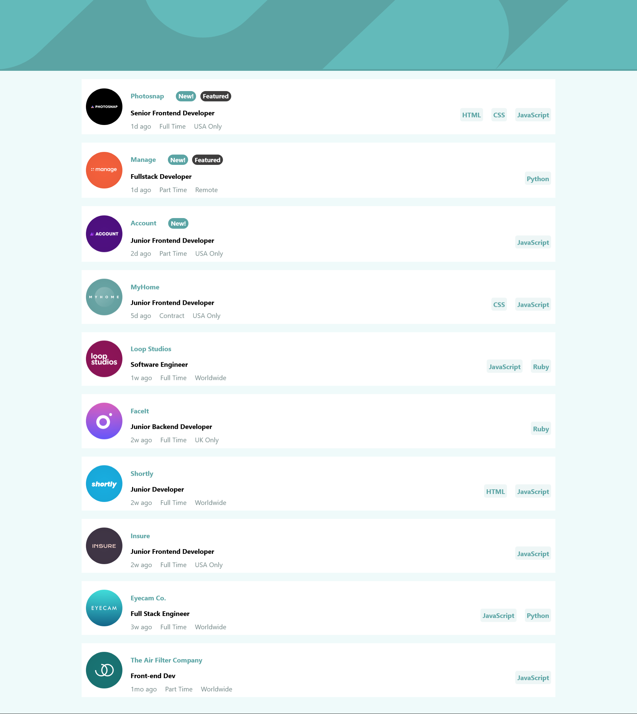
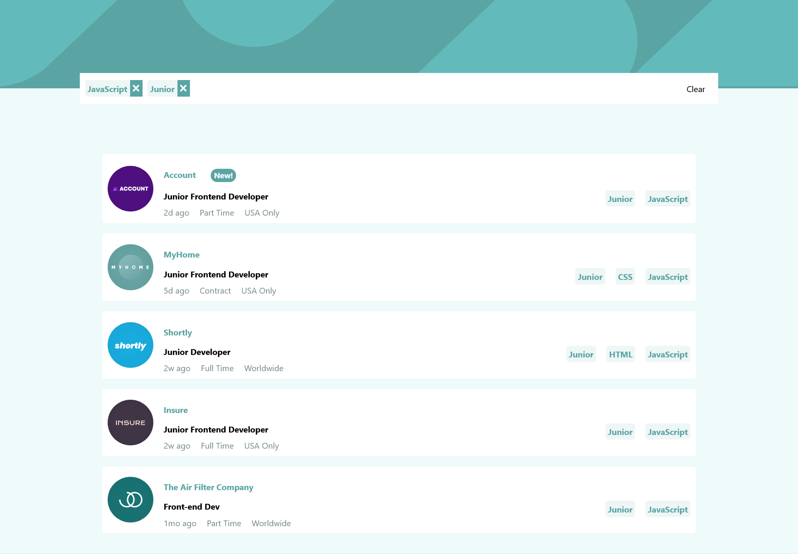
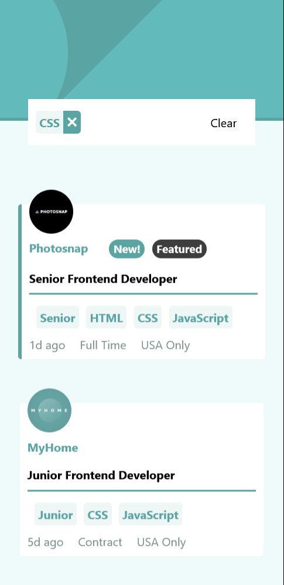

# Frontend Mentor - Job listings with filtering solution

This is a solution to the [Job listings with filtering challenge on Frontend Mentor](https://www.frontendmentor.io/challenges/job-listings-with-filtering-ivstIPCt). Frontend Mentor challenges help you improve your coding skills by building realistic projects. 

## Table of contents

- [Overview](#overview)
  - [Screenshot](#screenshot)
  - [Links](#links)
- [My process](#my-process)
  - [Built with](#built-with)
  - [What I learned](#what-i-learned)
- [Author](#author)

## Overview

### The challenge

The challenge was to build out this job listing page and get it looking as close to the design as possible.

You can use any tools you like to help you complete the challenge. So if you've got something you'd like to practice, feel free to give it a go.

Your users should be able to:

- View the optimal layout for the site depending on their device's screen size
- See hover states for all interactive elements on the page
- Filter job listings based on the categories

#### Filtering

Use the [data.json](./data.json) file to pull the data and then dynamically add the content. This would be perfect if you're looking to practice a JS library/framework like React, Vue, or Svelte.

To add a filter, the user needs to click on the tablets on the right side of the listing on desktop or the bottom on mobile. For each filter added, only listings containing all selected filters should be returned.

### Screenshots

#### Desktop design

#### Mobile design

### Links

- Live Site URL: [Vercel](https://job-listing-app-kappa.vercel.app/)

## My process

### Built with

 Semantic HTML5 markup
- CSS custom properties
- Flexbox
- Mobile-first workflow
- [React](https://reactjs.org/) - JS library

### What I learned

I have revisited React , CSS flexbox , Responsive design and Mobile-first workflow ;

## Author

- Website - [Abdulrahman Badr](https://www.linkedin.com/in/abdulrahmanbadr99/)
- Frontend Mentor - [@abdulrahman9901](https://www.frontendmentor.io/profile/abdulrahman9901)
- Twitter - [@Abdulrahman_Bdr](https://twitter.com/Abdulrahman_Bdr)
